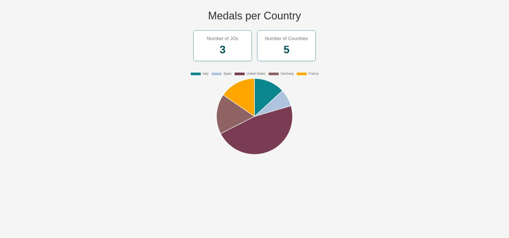
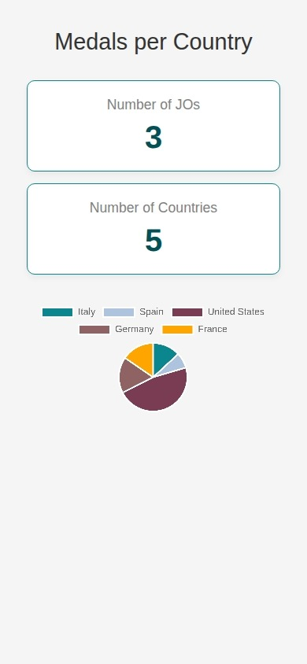
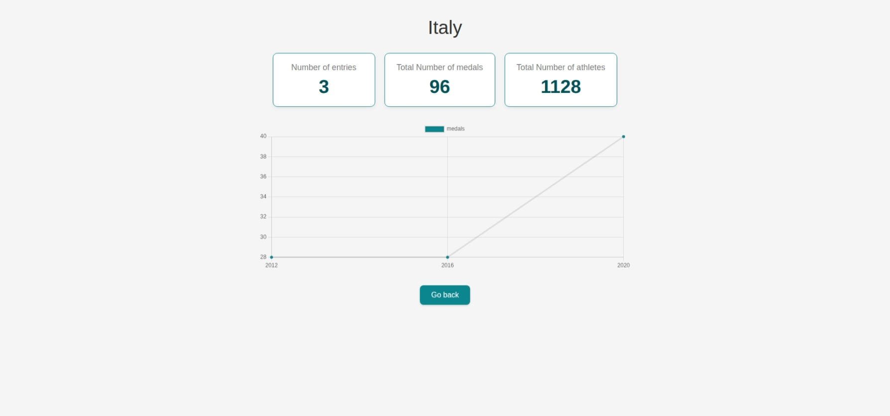
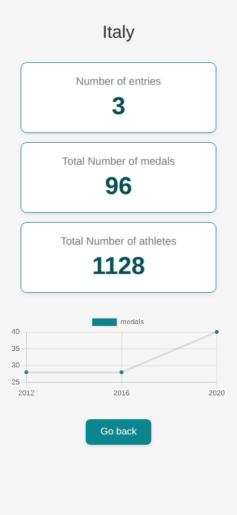

# Télésport - Application des Statistiques des Jeux Olympiques

Ce projet est une application Angular (v18+) développée dans le cadre de la formation OpenClassrooms Développeur Full-Stack - Java et Angular. Cette dernière affiche les statistiques des médailles des Jeux Olympiques par pays et permet de naviguer pour voir le détail de chaque pays.

---

## Aperçu

Voici un aperçu des deux pages principales de l'application.

### 1. Page d'accueil (Dashboard)

Affiche une vue d'ensemble de tous les pays participants, avec un Pie Chart cliquable.

**(Desktop)**


**(Mobile)**


### 2. Page de Détail (Pays)

Affiche les statistiques détaillées pour un pays sélectionné, avec un Line Chart de l'évolution du nombre de médailles au cours du temps.

**(Desktop)**


**(Mobile)**


---

## Sommaire

- [Fonctionnalités](#fonctionnalités)
- [Installation et Lancement](#installation-et-lancement)
- [Architecture du Projet](#architecture-du-projet)

---

## Fonctionnalités

L'application implémente les fonctionnalités suivantes, conformément au cahier des charges :

- **Dashboard principal** affichant les KPIs globaux (nombre de pays, nombre de JOs).
- **Graphique Pie Chart** interactif montrant le total des médailles par pays.
- **Navigation au clic** du graphique vers la page de détail du pays (`/country/:id`).
- **Page de détail** affichant les KPIs d'un pays (nombre de participations, total des médailles, total des athlètes).
- **Graphique Line Chart** montrant l'évolution du nombre de médailles par année pour ce pays.
- **Gestion complète des états :**
  - **Loading :** Affiche un spinner pendant le chargement des données.
  - **Error :** Affiche un message d'erreur clair si l'API échoue.
  - **Empty :** Affiche un message "Aucune donnée" si l'API ne retourne rien (sur le Dashboard).
  - **Not Found :** Redirige vers une page 404 si un ID de pays est introuvable.
- **Responsive Design** (Desktop, Tablette, et Mobile)

## Installation et lancement

### Prérequis

- [Node.js](https://nodejs.org/) (v18.x ou v20.x recommandée)
- Angular CLI (`npm install -g @angular/cli`)

### Instructions

1.  **Clonez le dépôt :**

    ```bash
    git clone https://github.com/apalermo/olympic-games-app.git
    ```

2.  **Accédez au dossier :**

    ```bash
    cd src/
    ```

3.  **Installez les dépendances :**

    ```bash
    npm install
    ```

4.  **Lancez le serveur de développement :**

    ```bash
    ng serve
    ```

5.  Ouvrez votre navigateur et allez sur `http://localhost:4200/`.

## Architecture du Projet

L'architecture suit les principes modernes d'Angular (Standalone Components, Smart/Dumb Components) pour une séparation claire des responsabilités.

## Architecture

Pour une documentation détaillée de l'architecture, veuillez consulter le fichier [ARCHITECTURE.md](src/ARCHITECTURE.md).
